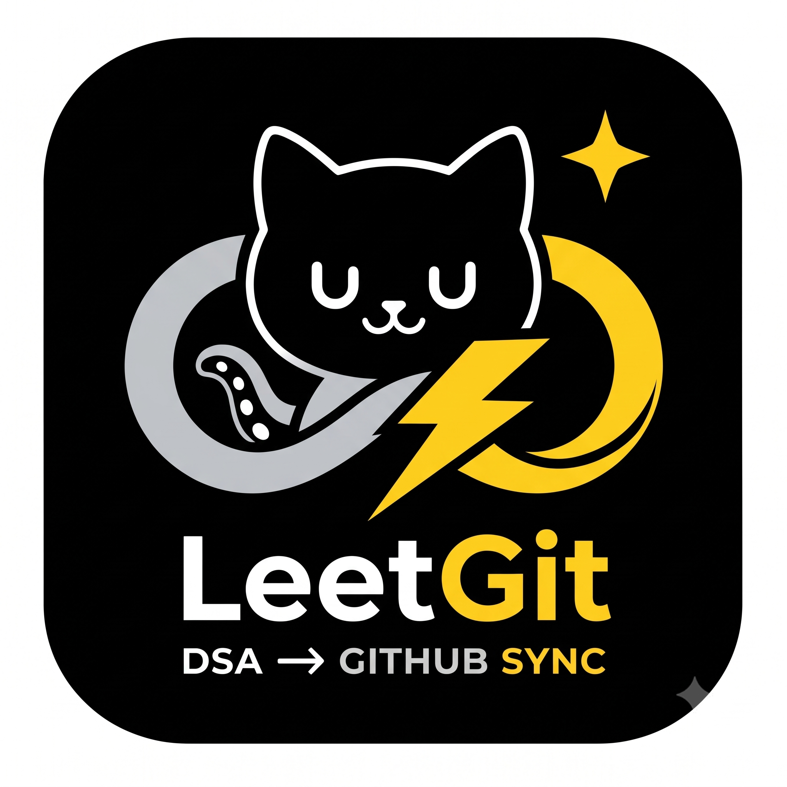

  <p align="center">
  
</p>

<h1 align="center">LeetGit</h1>

<p align="center">
  Sync your LeetCode solutions to GitHub.
</p>

 
 🚀 LeetGit — LeetCode to GitHub Sync

**Solve. Sync. Build your coding journey.**

LeetGit is a Chrome extension that helps developers sync accepted LeetCode solutions to GitHub. It connects LeetCode, GitHub, and a Spring Boot backend to make maintaining a coding-solutions repository easier.

> **Current version:** V1 — LeetCode solution sync. The interactive DSA and Dev dashboard is planned for a future version.

## ✨ Features

- 🔄 Sync accepted LeetCode solutions to GitHub.
- 📦 Bulk import previously submitted solutions.
- ⚡ Sync future accepted submissions through the extension.
- 🔐 Connect GitHub and authorize repository access.
- ☁️ Use the Spring Boot backend deployed on Railway.
- 🧩 Access LeetGit while working on LeetCode.

## 🛠️ Tech Stack

| Technology | Purpose |
|---|---|
| Java | Backend |
| Spring Boot | REST APIs and backend services |
| Maven | Build and dependency management |
| MySQL | Database |
| HTML, CSS, JavaScript | Chrome extension |
| LeetCode GraphQL | Retrieve LeetCode data |
| GitHub API | Repository integration |
| GitHub App | GitHub authorization and access |
| Railway | Backend deployment |

## 🏗️ How It Works

```text
LeetCode
   │ GraphQL
   ▼
LeetGit Chrome Extension
   │ API requests
   ▼
Spring Boot Backend
   ├── MySQL
   └── GitHub API
          ▼
   Your GitHub Repository
```

LeetGit retrieves relevant LeetCode submission data, uses its backend for authentication and sync-related operations, and integrates with GitHub to store solutions in the selected repository.

## 📥 Installation

1. Visit the [LeetGit Releases](https://github.com/adityam2705/LeetGit-Dashboard-V1/releases) page.
2. Download the latest extension ZIP.
3. Extract the ZIP file.
4. Open Chrome and visit `chrome://extensions`.
5. Enable **Developer mode**.
6. Click **Load unpacked**.
7. Select the extracted folder containing `manifest.json`.
8. Open LeetCode and launch LeetGit.

> This extension is currently installed manually and is not distributed through the Chrome Web Store.

## 🚦 Getting Started

1. Sign in to LeetCode.
2. Launch the LeetGit extension.
3. Sign in to LeetGit as prompted.
4. Connect GitHub and authorize access to the intended repository.
5. Start syncing your solutions.
6. Check your GitHub repository to verify the synced files.

## 🧰 Troubleshooting

### Sync gets stuck or fails

**Refresh the LeetCode problem page and try again.** This helped recover from a sync issue during development.

### GitHub permission error
